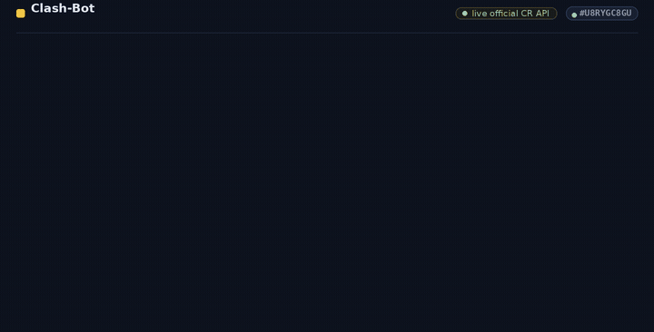

# Clash-Bot

Clash-Bot is an API backend for LLM-powered chat app built for Clash Royale players.
Using tool-calls with LLMs it retrieves real-time data from the official Clash Royale API to provide accurate, up-to-date answers to players' questions.

One of the main ways Clash Royale players check their or other players' in-game stats, battle history and other infromation is through RoyaleAPI website with a player tag. Finding specific information requires navigating through multiple pages, their sections and endless buttons. Clash-Bot makes this process faster and more natural. Players can simply ask questions in a chat and get answers from LLM with accurate data.

## Run

    make db/migrate/up
    make run/api

## Tests

Unit, integration, and end-to-end tests.

    make test
    make test/integration
    make test/e2e

## Tech Stack

- Go
- PostgreSQL
- Gemini 
- Cloudflare R2
